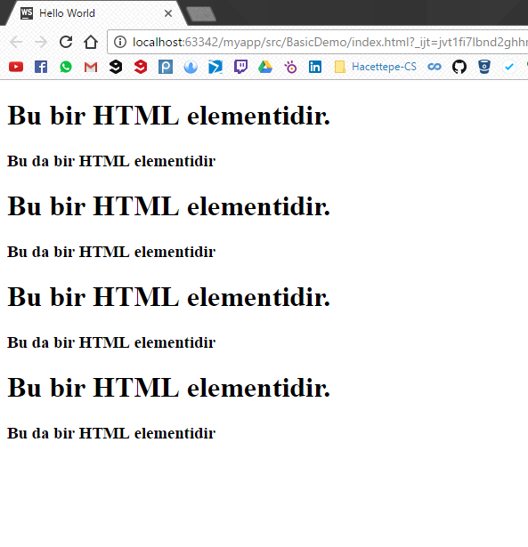

# Bileşenler 2

Bu başlıkta birden fazla HTML elementini bir ReactJS bileşeninde nasıl kullanıcağımızı görüceğiz.

#### Birden çok HTML element içeren ReactJS Bileşeni

Önceki sayfada gördüğümüz üzere

```js
        var Comp  = React.createClass({
            render: function () {
                return (<h1>Bu bir reactJS bilesenidir!</h1>);
            }
        });
```

createClass\(\) method'una bir ana HTML elementi vermemiz gerekiyor. Yani kodu biraz değiştirirsek ve bu hale getirirsek;

```js
        var Comp  = React.createClass({
            render: function () {
                return (<h1>Bu bir HTML elementidir!</h1>
                        <h3>Bu da bir HTML elementidir!</h3>);
            }
        });
```

kodumuz çalışmayacaktır. Çünkü bu şekilde createClass method'una 2 tane alt HTML elementi vermiş olduk ve createClass method'u ikisini beraber kullanamıyor ve ikisinden birisini de seçemiyor. Bu durumu şöyle düzeltiyoruz.

```js
        var Comp  = React.createClass({
            render: function () {
                return (<div>
                    <h1>Bu bir HTML elementidir.</h1>
                    <h3>Bu da bir HTML elementidir</h3>
                    </div>);
            }
        });
```

"h1" ve "h3" elementlerini bir "div" elementi altında toplayınca, HTML'in ağaç topoloji yapısından dolayı ana element "div" olmak üzere, kodumuz çalıştı.

**index.html**

```html
<!DOCTYPE html>
<html>
<head>
    <meta charset="UTF-8" />
    <title>Hello World</title>
    <script src="../js/react.min.js"></script>
    <script src="../js/react-dom.min.js"></script>
    <script src="../js/browser.min.js"></script>
</head>
<body>
    <div id="example"></div>
    <script type="text/babel">

        var Comp  = React.createClass({
            render: function () {
                return (<div>
                    <h1>Bu bir HTML elementidir.</h1>
                    <h3>Bu da bir HTML elementidir</h3>
                    </div>);
            }
        });
        ReactDOM.render(<Comp /> , document.getElementById("example"));
</script>
</body>
</html>
```

**Sayfamız**

#### Bir ReactJS bileşenini birden fazla kullanmak

Biliyoruz ki oluşturduğumuz ReactJS bileşenlerini ReactDOM.render\(\)

```js
ReactDOM.render(<Comp />, document.getElementById("example"));
```

method'u ile sayfanın içine gömüyoruz. Bu kodu şu şekilde değiştirirsek ;

```js
ReactDOM.render(<Comp /> <Comp /> <Comp /> <Comp />, document.getElementById("example"));
```

kodumuz çalışmayacaktır. Çünkü ReactDOM.render\(\) method'u da createClass\(\) method'u gibi bir tane ana HTML elementi alıyor parametre olarak ve yukarıdaki kodda dört tane bileşen verdik ve render method'u bunlarla ne yapacağını bilemiyor. Bu durumu kullanmak istediğimiz bileşenleri "div" elementi içerisine koyarak düzeltebiliyoruz.

şöyle düzeltiyoruz.

```js
        ReactDOM.render(<div>
            <Comp />
            <Comp />
            <Comp />
        </div> , document.getElementById("example"));
```

İki alt başlıkta da aynı durumun geçerli olmasının sebebi HTML dosyalarının ağaç topolojisi üzerine oturtulmuş olması. Sonuçta oluşturduğumuz ReactJS bileşenleri birer HTML elementinden ibaret ve HTML elementlerinde olduğu gibi ReactJS bileşenleri de birbiri içerisine geçmiş\(node-root yapısı\) bir yapıda olması gerekiyor.

**index.html**

```html
<!DOCTYPE html>
<html>
<head>
    <meta charset="UTF-8" />
    <title>Hello World</title>
    <script src="../js/react.min.js"></script>
    <script src="../js/react-dom.min.js"></script>
    <script src="../js/browser.min.js"></script>
</head>
<body>
    <div id="example"></div>
    <script type="text/babel">

        var Comp  = React.createClass({
            render: function () {
                return (<div>
                    <h1>Bu bir HTML elementidir.</h1>
                    <h3>Bu da bir HTML elementidir</h3>
                    </div>);
            }
        });
        ReactDOM.render(<div><Comp /><Comp /><Comp /><Comp /></div> , document.getElementById("example"));
</script>
</body>
</html>
```

**Sayfamız**



