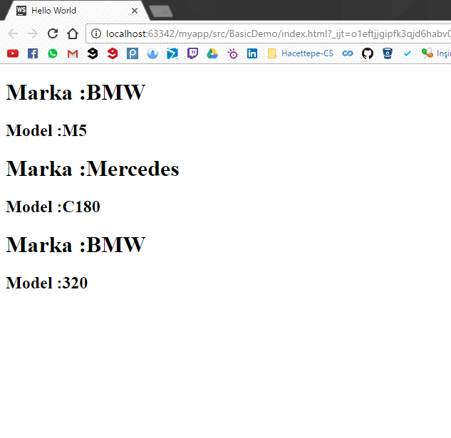

# Bileşenler 3

Bu başlıkta ReactJS bileşenlerinin özelliklerini  ve HTML elementlerinden farklılaştıkları noktaları göreceğiz.

Her ReactJS bileşeni bir sınıfın objesi olduğundan dolayı \(hatırlatma : her bileşen createClass\(\) method'u ile oluşturuluyor\), bu objelerin html elementlerinde olan özelliklerden farklı olarak değişik özellikler ekleyebiliyoruz. Buda bileşenleri istediğimiz şekilde özelleştirebildiğimiz anlamına geliyor. Örneğin arabalarla ilgili bir uygulama yapıyoruz ve farklı arabaları göstermemiz gerekiyor. ReactJS ile tek yapmamız gereken bir araba bileşeni oluşturmak ve istenilen şekilde kullanmak.

```js
        var Araba  = React.createClass({
            render: function () {
                return (<div>
                    <h1>Marka :{this.props.marka}</h1>
                    <h2>Model :{this.props.model}</h2>
                    </div>);
            }
        });
```

Şimdi araba bileşenimizi oluşturduk. Ama bu bileşeni nasıl kullanacağız ?  Kullanımı da oluşturması kadar kolay ve basit.

ReactDOM.render\(\) method'u içerisinde araba bileşenimizin "marka" ve "model" özelliklerini belirleyebiliyoruz.

```js
        ReactDOM.render(<div>
            <Araba marka="BMW" model="M5"/>
            <Araba marka="Mercedes" model="C180"/>
            <Araba marka="BMW" model="320"/>
        </div>, document.getElementById("example"));
```

Bu kodla beraber üç tane farklı arabamızı kolay bir şekilde "example" idli "div" elementimizin içerisine gömmüş olduk.

**index.html**

```html
<!DOCTYPE html>
<html>
<head>
    <meta charset="UTF-8" />
    <title>Hello World</title>
    <script src="../js/react.min.js"></script>
    <script src="../js/react-dom.min.js"></script>
    <script src="../js/browser.min.js"></script>
</head>
<body>
    <div id="example"></div>
    <script type="text/babel">

        var Araba  = React.createClass({
            render: function () {
                return (<div>
                    <h1>Marka :{this.props.marka}</h1>
                    <h2>Model :{this.props.model}</h2>
                    </div>);
            }
        });
        ReactDOM.render(<div>
            <Araba marka="BMW" model="M5"/>
            <Araba marka="Mercedes" model="C180"/>
            <Araba marka="BMW" model="320"/>
        </div>, document.getElementById("example"));
</script>
</body>
</html>
```

**Sayfamız**



