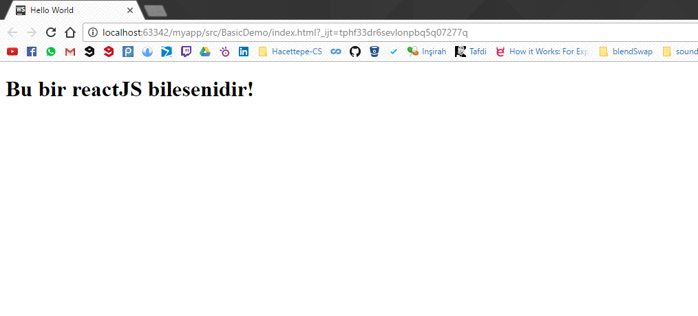

# Bileşenler 1

ReactJS'de oluşturduğumuz ve yönettiğimiz her öge aslında bir bileşen\(componenet\). Ve bu bileşenleri ReactJS ile istenilen şekilde kontrol edebiliyoruz. Bileşenleri parçalayıp küçük bileşenler oluşturabilir ve ya olan bileşenleri birleştirip daha büyük bileşenler oluşturabiliriz. Sonuç olarak ReactJS ile oluşturduğunuz web uygulaması değişik bileşenlerden oluşmaktadır.

### Bileşen oluşturmak

Bileşen oluşturmak için

```js
    <script type="text/babel">

        var Comp  = React.createClass({
            render: function () {
                return (<h1>Bu bir reactJS bilesenidir!</h1>);
            }
        });
        ReactDOM.render(<Comp />, document.getElementById("example"));
</script>
```

kod parçasını kullanacağız. Demoda kullandığımız "div" element'imiz aynı şekilde duruyor. Farklı olarak yaptığımız şey şu;

```js
var Comp
```

Comp adında bir değişken oluşturduk. Ama bu bileşeni    React.createClass\(\) method'u ile oluşturduk. createClass\(\) method'u parametre olarak bir HTML ana element'i alıyor. Ve bir bu HTML elementini  render  fonksiyonunu kullanarak oluşturduk.

```js
render: function () {
    return (<h1>Bu bir reactJS bilesenidir!</h1>);
}
```

Render method'un görevi bir HTML ana element'i döndürmek.Ve sonuç olarak createClass\(\) method'unun içine bir "h1" element'i göndermiş olduk. Son olarak;

```js
ReactDOM.render(<Comp />, document.getElementById("example"));
```

satırı ile bileşenimizi önceden "body" elementi aldında oluşturduğumuz "div" elementinin içine koyduk.


**index.html**

```html
<!DOCTYPE html>
<html>
<head>
    <meta charset="UTF-8" />
    <title>Hello World</title>
    <script src="../js/react.min.js"></script>
    <script src="../js/react-dom.min.js"></script>
    <script src="../js/browser.min.js"></script>
</head>
<body>
    <div id="example"></div>
    <script type="text/babel">

        var Comp  = React.createClass({
            render: function () {
                return (<h1>Bu bir reactJS bilesenidir!</h1>);
            }
        });
        ReactDOM.render(<Comp />, document.getElementById("example"));
</script>
</body>
</html>

```


**Sayfamız**




