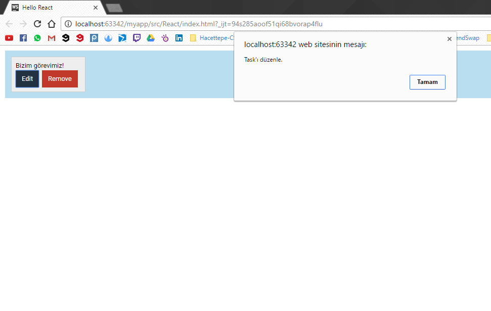

# Olayları Yönetme

Bu başlıkta ReactJS de olayları yönetmekten bahsediyor olacağız. Projeye ayrı olarak css dosyası eklendim. Dosyayı [buradan ](https://drive.google.com/drive/folders/0BxLeFDQhe16BdG4wcFpySU51UHc?usp=sharing)indirip projenize ekleyebilirsiniz.

İlk önce Task adında bir bileşen oluşturacağız ve bu bileşenin iki tane butonu olacak.

```js
    var Task = React.createClass({
        render: function () {
            return (
                    <div className="commentContainer">
                        <div>Bizim görevimiz!</div>
                        <button onclick="edit" className="button-primary">Edit</button>
                        <button onclick="remove" className="button-danger">Remove</button>
                    </div>
            );
        }
    });
```

Kodda gördüğümüz üzere bu iki buton tıklanıldığında "edit" ve "remove" adında iki fonksiyonu çağırıyor.

Bu iki fonksiyonuda kodumuza eklememiz gerekiyor.

```js
    var Task = React.createClass({
        edit: function () {
          alert("Task'ı düzenle.");
        },
        remove: function () {
            alert("Task'ı sil.")
        },
        render: function () {
            return (
                    <div className="commentContainer">
                        <div>Bizim görevimiz!</div>
                        <button onclick="edit" className="button-primary">Edit</button>
                        <button onclick="remove" className="button-danger">Remove</button>
                    </div>
            );
        }
    });
```

ReactJS'te olayları yönetmenin bir çok yöntemi var. Şu an ihtiyacımız olan butonları yönetmek. Şu anlık butonlar sadece alert görevini yerine getiriyorlar ama ilerleyen başlıklarda Task Management sayfamız için gerekli olacaklar.

Son olarak ReactDOM.render\(\) method'unu kullanmamız gerekiyor.

```js
    ReactDOM.render(<div className="board">
        <Task/>
    </div>, document.getElementById("container"));
```

**index.html**

```html
<!DOCTYPE html>
<html>
<head>
    <meta charset="UTF-8" />
    <title>Hello React</title>
    <link rel="stylesheet" type="text/css" href="../css/main.css">
    <script src="../js/react.min.js"></script>
    <script src="../js/react-dom.min.js"></script>
    <script src="../js/browser.min.js"></script>
</head>
<body>
<div id="container"></div>

<script type="text/babel">

    var Task = React.createClass({
        edit: function () {
          alert("Task'ı düzenle.");
        },
        remove: function () {
            alert("Task'ı sil.")
        },
        render: function () {
            return (
                    <div className="commentContainer">
                        <div>Bizim görevimiz!</div>
                        <button onClick={this.edit} className="button-primary">Edit</button>
                        <button onClick={this.remove} className="button-danger">Remove</button>
                    </div>
            );
        }
    });
    ReactDOM.render(<div className="board">
        <Task/>
    </div>, document.getElementById("container"));
</script>
</body>
</html>
```

**Sayfamız\(Edit buton'una tıklanmış hali\)**

En son olarak yapacağımız, görevimizin Text kısmını dinamik olarak değiştirmek. Şu ana kadar verilmiş kodda Task'ımızın Text kısmı statik ve değişmiyor. Yapmamız gereken kodumuzu biraz değiştirmek ve Text'imizi bileşenin children'ı olarak ReactDOM.render\(\) method'unda vermek.

```js
    var Task = React.createClass({
        edit: function () {
          alert("Task'ı düzenle.");
        },
        remove: function () {
            alert("Task'ı sil.")
        },
        render: function () {
            return (
                    <div className="commentContainer">
                        <div className="commentText">{this.props.children}</div>
                        <button onClick={this.edit} className="button-primary">Edit</button>
                        <button onClick={this.remove} className="button-danger">Remove</button>
                    </div>
            );
        }
    });
    ReactDOM.render(<div className="board">
        <Task>Dinamik Textli Görevimiz!</Task>
    </div>, document.getElementById("container"));
```

**Sayfamız \(Dinamik Text\)**

