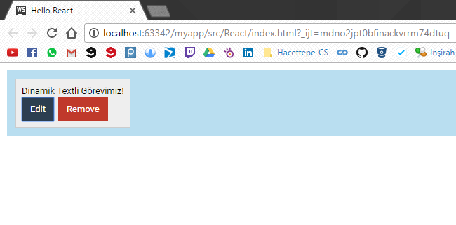
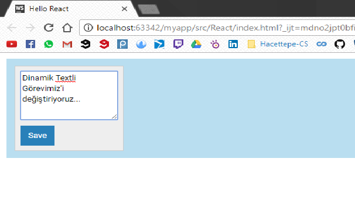

# State\(Durum\) 2

Bu başlıkta, kodumuza Olayları Yönetme başlığında kaldığımız yerden, yani Task Management Projemize devam edeceğiz.

Kaldığımız yer;

```js
<!DOCTYPE html>
<html>
<head>
    <meta charset="UTF-8" />
    <title>Hello React</title>
    <link rel="stylesheet" type="text/css" href="../css/main.css">
    <script src="../js/react.min.js"></script>
    <script src="../js/react-dom.min.js"></script>
    <script src="../js/browser.min.js"></script>
</head>
<body>
<div id="container"></div>

<script type="text/babel">

    var Task = React.createClass({
        edit: function () {
            alert("Task'ı düzenle.");
        },
        remove: function () {
            alert("Task'ı sil.")
        },
        render: function () {
            return (
                    <div className="commentContainer">
                        <div className="commentText">{this.props.children}</div>
                        <button onClick={this.edit} className="button-primary">Edit</button>
                        <button onClick={this.remove} className="button-danger">Remove</button>
                    </div>
            );
        }
    });
    ReactDOM.render(<div className="board">
        <Task>Dinamik Textli Görevimiz!</Task>
    </div>, document.getElementById("container"));
</script>
</body>
</html>
```

Hatırladığımız üzere üst kısımdaki kodda "edit" ve "delete" butonlarına bastığımızda sayfada herhangi bir değişiklik olmuyor; sadece "alert\(\)" methodu çağrılıyordu. Bu başlıkta yapacağımız değişiklikler ile Task bileşenimizin içerisindeki text'i "edit" tuşuyla değiştirebileceğiz.

Bileşenimize bir state ekleyeceğiz ve bu state text'imizin edit ya da normal modda olup olmadığını gösterecek. Bizde state'imizin durumuna göre bileşenimizi update edeceğiz.

İlk önce "editing" adında bir state ekliyoruz bileşenimize.

```js
        getInitialState: function () {
            return(
                {editing: false}
            );
        }
```

"editing" state'imize initial değerini verdikten sonra yapacağımız değişiklik "edit" fonksiyonunu değiştirmek olacak.

```js
        edit: function () {
            this.setState({
                editing: true
            });
        }
```

Şimdi "edit" fonksiyonu artık "alert\(\)"  methodunu çağırmıyor, daha önce oluştuduğumuz "editing" state'inin değerini "true"ya atıyor. "edit" butonuna bastıktan sonra textimizi değiştirebilmek için bir "textarea" elementine ihitacımız olacak. Yani iki ayrı html koduna ihtiyacımız olacak ama şu an ki "render" fonksiyonumuz bir tane html kodu döndürüyor. Bu nedenden dolayı "editMode" ve "normalMode" adında iki tane yeni fonksiyon oluşturacağız."editMode" fonksiyonu "editing" state'i true olduğunda gösterilecek bir html kodu döndürecek ve "normalMode"  fonksiyonu "editing" state'i false olduğunda gösterilecek html kodunu döndürecek. Ama biliyoruz ki değişiklikleri kontrol eden, olmazsa olmaz varsayılan fonksiyonumuz "render" fonksiyonu. Bu nedenden dolayı render fonksiyonunu'da  da değişiklik yapmamız gerekiyor.

_"editingMode" fonksiyonu:_

```js
        editingMode: function () {
            return (
                    <div className="commentContainer">
                        <textarea defaultValue={this.props.children}></textarea>
                        <button onClick={this.save} className="button-secondary">Save</button>
                    </div>
            );
        }
```

"editingMode" fonksiyonu istediğimiz şekilde bir "save" butonu ve "textarea" elementi içeriyor ve bu "textarea" elementinin içerisinde de bileşenin children'i olarak aldığımız değer var. "save" butonuda "save" adında bir fonksiyonu çağırıyor ve bu fonksiyon da "editing" state'imizi false'a set edecek.

_"save" fonksiyonu:_

```js
        save: function () {
            this.setState({
                editing: false
            })
        }
```

_"normalMode" fonksiyonu_

```js
        normalMode: function () {
            return (
                    <div className="commentContainer">
                        <div className="commentText">{this.props.children}</div>
                        <button onClick={this.edit} className="button-primary">Edit</button>
                        <button onClick={this.remove} className="button-danger">Remove</button>
                    </div>
            );
        }
```

Bu iki fonksiyonu yazdıktan sonraki işimiz; render fonksiyonunu değiştirmek.

_Yeni "render" fonksiyonu:_

```js
        render: function () {
            if(this.state.editing){
                return this.editingMode();
            }else{
                return this.normalMode();
            }
        }
```

Yeni render fonksiyonumuzda "editing" state'imizin durumuna göre "editingMode" ya da "normalMode" fonksiyonlarından birini döndüreceğiz. Yani sonuç olarak dönecek olan html kodu yine varsayılan "render" fonksiyonundan  dönüyor.


**index.html**

```html
<!DOCTYPE html>
<html>
<head>
    <meta charset="UTF-8" />
    <title>Hello React</title>
    <link rel="stylesheet" type="text/css" href="../css/main.css">
    <script src="../js/react.min.js"></script>
    <script src="../js/react-dom.min.js"></script>
    <script src="../js/browser.min.js"></script>
</head>
<body>
<div id="container"></div>

<script type="text/babel">

    var Task = React.createClass({
        getInitialState: function () {
            return(
                {editing: false}
            );
        },
        edit: function () {
            this.setState({
                editing: true
            });
        },
        remove: function () {
            alert("Task'ı sil.")
        },
        save: function () {
            this.setState({
                editing: false
            })
        },
        normalMode: function () {
            return (
                    <div className="commentContainer">
                        <div className="commentText">{this.props.children}</div>
                        <button onClick={this.edit} className="button-primary">Edit</button>
                        <button onClick={this.remove} className="button-danger">Remove</button>
                    </div>
            );
        },
        editingMode: function () {
            return (
                    <div className="commentContainer">
                        <textarea defaultValue={this.props.children}></textarea>
                        <button onClick={this.save} className="button-secondary">Save</button>
                    </div>
            );
        },
        render: function () {
            if(this.state.editing){
                return this.editingMode();
            }else{
                return this.normalMode();
            }
        }
    });
    ReactDOM.render(<div className="board">
        <Task>Dinamik Textli Görevimiz!</Task>
    </div>, document.getElementById("container"));
</script>
</body>
</html>
```

**Sonuç**

_Sayfamızın ilk hali:_



_Edit butonuna bastıktan sonra:_



_Save butonuna bastıktan sonra:_


Sonuç olarak görebiliyoruz ki  Task bileşenimizin html kodunu değiştirebiliyoruz ama "editingMode" 'da iken yazdıklarımız kayıt edilmedi. Bu veri transferini ilerleyen başlıklarla göreceğiz.

