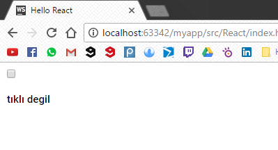

# State\( Durum \)

Bu başlık altında bileşenlerin statelerinden bahsedeceğiz. Stateler bileşenlere verdiğimiz özelliklere benziyorlar ama aralarındaki fark şu ki; bileşene bir özellik verdiğimizde bu özellik o bileşenin hayatının sonuna kadar atanmış olur. ReactJS'in stateleriyle beraber bileşenlerimize istediğimiz zaman kolaylıkla ve hızlıca değiştirebileceğimiz özellikler atamış oluyoruz.

Bir tane checkbox bileşeni oluşturmayla işe başlayalım.

```js
       var CheckBox = React.createClass({
          render: function () {
            var msg;
            if(this.state.checked){
                msg = 'tıklı'
            }else{
                msg = 'tıklı degil'
            }
            return(
                    <div>
                        <input type="checkbox"/>
                        <h3>{msg}</h3>
                    </div>
            );
        }
    );
```

Bileşenlerin statelerine, özelliklerine oluşatuğimız şekilde "this.state" ile ulaşıyoruz ve üstteki kodda "checked" isimli bir state'imiz var. Ama state'in bir ilk değeri yok ve bileşlerin ilk kez render edilmeden önce state'i bir variable atamamız gerekicek. Bunuda "getInitialState" fonksiyonu ile yapıyoruz.

```js
    var CheckBox = React.createClass({
        getInitialState: function () {
            return({
                checked: false
            });
        },
        render: function () {
            var msg;
            if(this.state.checked){
                msg = 'tıklı'
            }else{
                msg = 'tıklı degil'
            }
            return(
                    <div>
                        <input type="checkbox"/>
                        <h3>{msg}</h3>
                    </div>
            );
        }
    });
    ReactDOM.render(<CheckBox/>, document.getElementById('container'));
```

"getInitialState" methodu ile isteğimiz kadar state'i atayabiliriz. Ama şu an ihtiyacımız olan sadece "checked" state'ini atamak.

**index.html**

```
<!DOCTYPE html>
<html>
<head>
    <meta charset="UTF-8" />
    <title>Hello React</title>
    <link rel="stylesheet" type="text/css" href="../css/main.css">
    <script src="../js/react.min.js"></script>
    <script src="../js/react-dom.min.js"></script>
    <script src="../js/browser.min.js"></script>
</head>
<body>
<div id="container"></div>

<script type="text/babel">


    var CheckBox = React.createClass({
        getInitialState: function () {
            return({
                checked: false
            });
        },
        render: function () {
            var msg;
            if(this.state.checked){
                msg = 'tıklı'
            }else{
                msg = 'tıklı degil'
            }
            return(
                    <div>
                        <input type="checkbox"/>
                        <h3>{msg}</h3>
                    </div>
            );
        }
    });
    ReactDOM.render(<CheckBox/>, document.getElementById('container'));
</script>
</body>
</html>
```

**Sonuç**



Şu ana kadar checkbox bileşenimizi ve "checked" isimli bir state oluşturduk. Ama checkbox'a tıkladığımızda yazımızda her hangi bir değişiklik olamayacak çünkü state'imizi değiştirecek bir kod yazmadık. Şimdi de stateimizi değiştirecek bir fonksiyon yazalım.

Ama bu fonksiyonu yazmadan önce bir önceki başlıkta gördüğümüz olay yönetme taktiğini kullanacağız. Kullandığımız checkbox bilelenini içerisinde bir "input" elementi var ve biz  bu elementte bir değişiklik olduğunda stateimizi değiştirmek istiyoruz.

```js
<input type="checkbox" onChange={this.checkboxStateChange} defaultChecked={this.state.checked}/>
```

"input" elementimizin "onChange" özelliğini "this.checkboxStateChange" methoduna atadık ve şimdi bu method'u yazmamız gerekiyor. Ayrıca "input" elementimizin "defaultChecked" özelliğinide daha dinamik bir çözüm için "checked" state'imizin değerine atadık.

```js
        checkboxStateChange: function () {
            this.setState({checked: !this.state.checked })
        }
```

"this.setState\(\)" method'u ile istediğimiz state'imizi yeniden atayabiliyoruz ve burda yapmak istediğimiz şey; eğer "checked" state'imizi her zaman kendinin tersine atamak. Yani "true" ise "false" yapsak, "false" ise "true" yapmak.

**index.html**

```html
<!DOCTYPE html>
<html>
<head>
    <meta charset="UTF-8" />
    <title>Hello React</title>
    <link rel="stylesheet" type="text/css" href="../css/main.css">
    <script src="../js/react.min.js"></script>
    <script src="../js/react-dom.min.js"></script>
    <script src="../js/browser.min.js"></script>
</head>
<body>
<div id="container"></div>

<script type="text/babel">


    var CheckBox = React.createClass({
        getInitialState: function () {
            return({
                checked: false
            });
        },
        checkboxStateChange: function () {
            this.setState({checked: !this.state.checked })
        },
        render: function () {
            var msg;
            if(this.state.checked){
                msg = 'tıklı'
            }else{
                msg = 'tıklı degil'
            }
            return(
                    <div>
                        <input type="checkbox" onChange={this.checkboxStateChange} defaultChecked={this.state.checked}/>
                        <h3>{msg}</h3>
                    </div>
            );
        }
    });
    ReactDOM.render(<CheckBox/>, document.getElementById('container'));
</script>
</body>
</html>
```

**Sonuç **


Sonuç olarak  checbox bileşenimizin içerisindeki "h3"  elementinin metni bileşenimizin "checked" state'ine göre değişiyor.  

